# Nexus Pay - Kiosk Payment System

## ℹ️ Introduction

**Nexus Pay** is a prototype software application designed for a physical kiosk machine that serves as an alternative payment method for students paying their school fees. It provides a more convenient and hassle-free way for students to complete payments while reducing the manual processes involved in traditional fee collection.

> **Note:** This is a prototype software solution intended for physical kiosk machine deployment. No hardware components are included in this release.

---

## 📊 System Overview

Nexus Pay streamlines the student tuition fee payment process through an intuitive kiosk interface. The system handles payment processing, balance tracking, multiple payment methods, and receipt generation — all designed for ease of use in an educational institution environment.

### Key Features Inside the System

- **Student Account Management**: Search and identify student records with validation
- **Balance Inquiry**: View current tuition balance and payment history
- **Multiple Payment Methods**: Support for various payment channels
- **Secure Processing**: PCI-compliant payment handling
- **Receipt Generation**: Automatic receipt printing and digital records
- **Overpayment Management**: Handle payment credits and balance adjustments
- **Auto-Logout**: Security feature for unattended kiosk environments
- **Real-time Payment Integration**: Direct payment gateway connectivity

---

## 💰 Payment Methods Supported

The system supports multiple payment options to accommodate different student preferences:

1. **Kiosk Direct Payment**: Process payments directly through the kiosk terminal
2. **PayMongo Integration**: Online payment gateway for seamless transactions
3. **Balance Deduction**: Apply overpayments or credits to outstanding balances

---

## 🖼️ System Workflow & Screenshots

### Landing Screen - Initial Interface
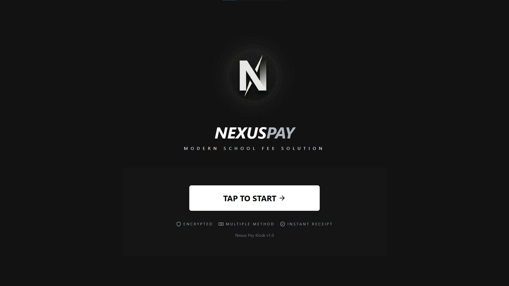
The welcome screen presenting available services and system status

### Service Selection - Choose Payment Type
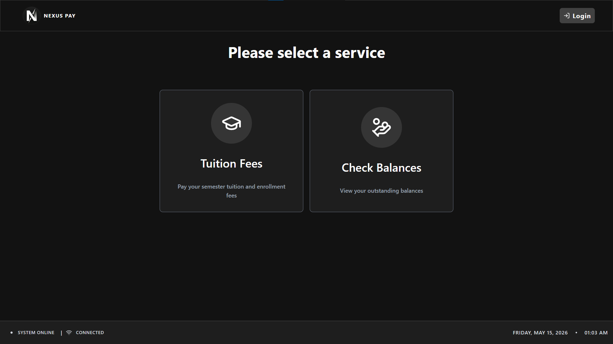
Student selects from available payment and inquiry services

### Check Balance - View Account Status
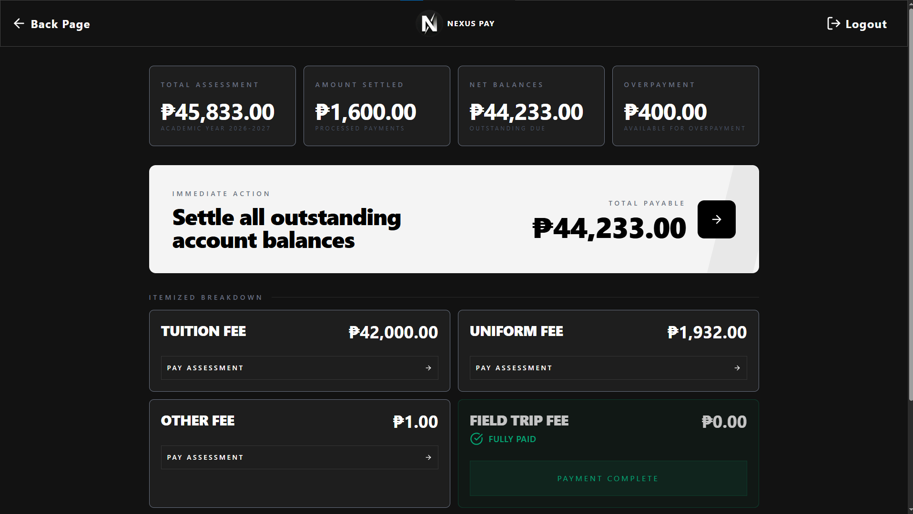
Display of current tuition balance and payment summary

### Payment Method - Choose Payment Channel
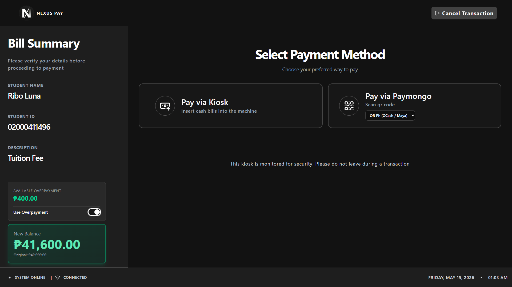
Student selects preferred payment method (kiosk or online gateway)

### Pay via Kiosk Terminal - Direct Payment
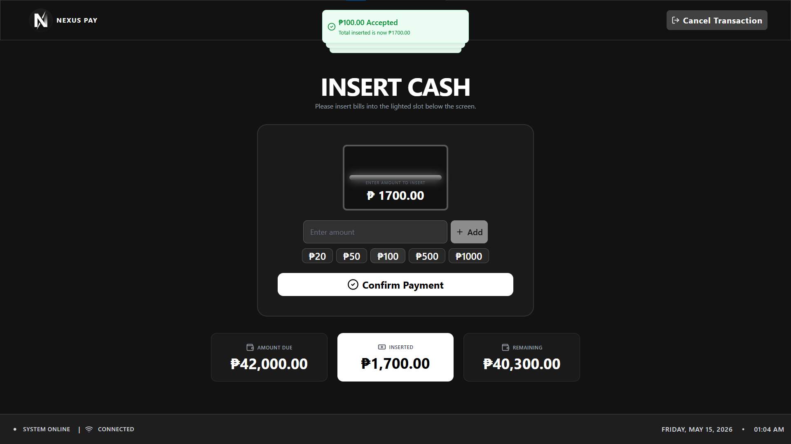
Direct payment processing through the kiosk terminal interface

### Pay via PayMongo - Online Gateway
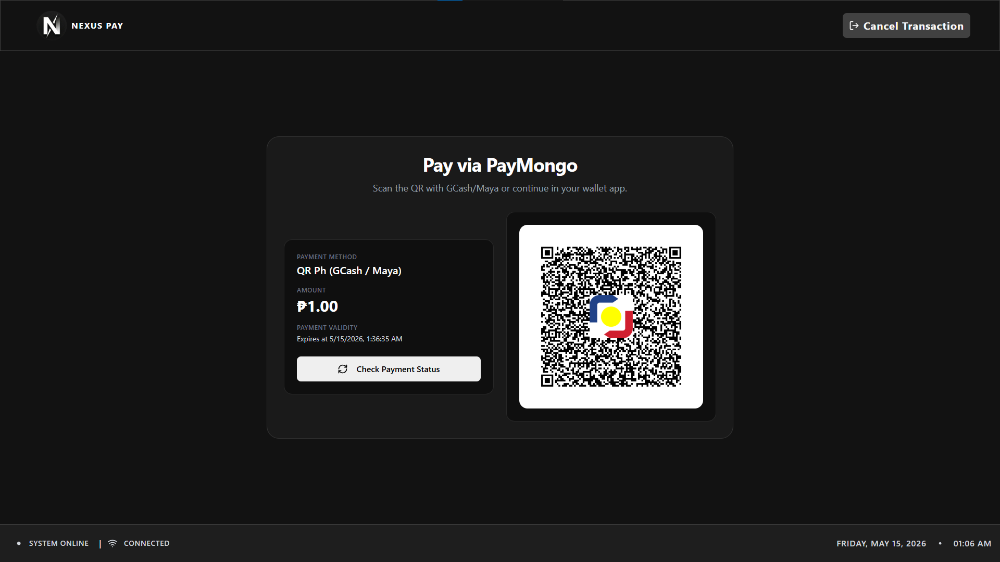
Secure payment processing through PayMongo payment gateway

### Processing Payment - Transaction Status
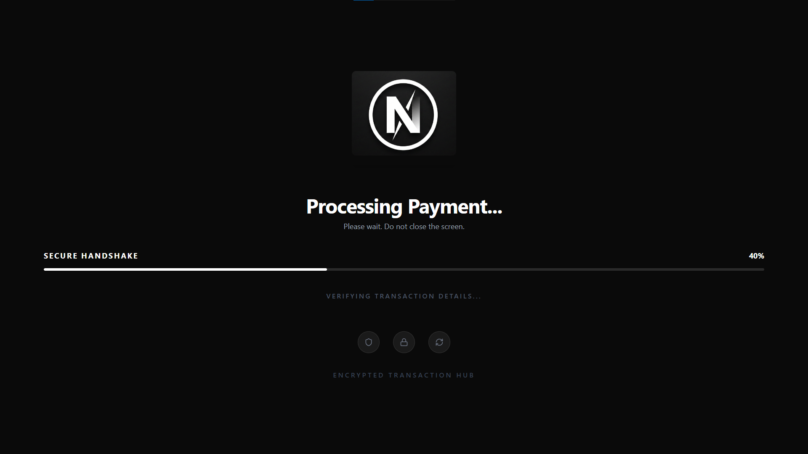
Real-time feedback during payment transaction processing

### Overpayment Features - Balance Management
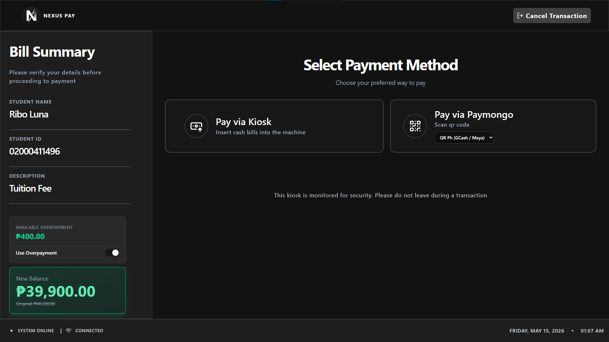
Apply overpayments or credits to deduct outstanding balance

### Receipt Generation - Payment Confirmation
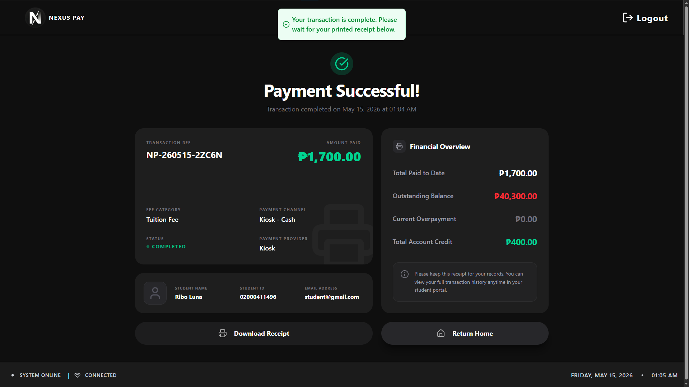 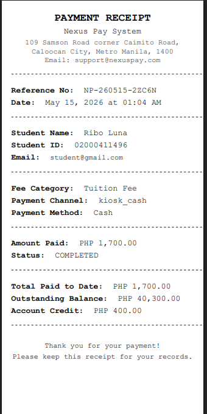
Digital and printable receipts for payment confirmation and records

### Auto-Logout Features - Security & Session Management
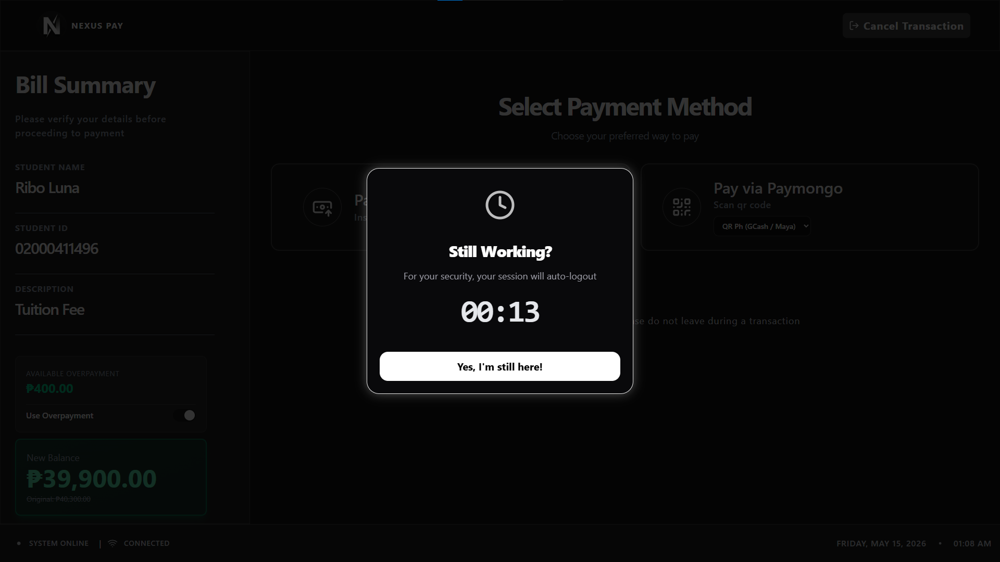
Automatic logout functionality ensuring secure kiosk operation between users

---

## 💻 Technology Stack

- **Backend**: Laravel PHP Framework
- **Frontend**: Vue.js with Inertia.js
- **Database**: MySQL
- **Payment Gateway**: PayMongo Integration
- **Build Tool**: Vite
---

## ⚖️ License & Notes

This is a prototype software for educational kiosk payment systems. All features are subject to testing and refinement.
